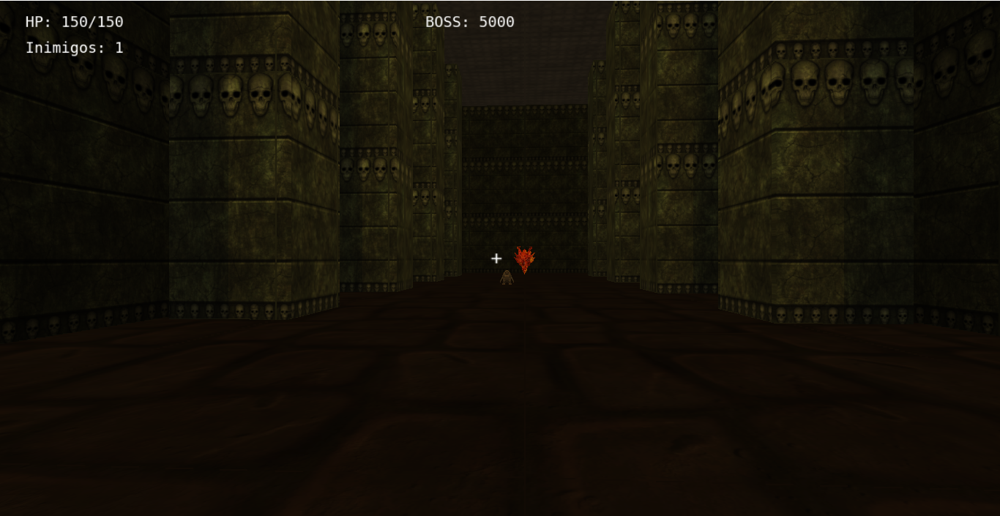
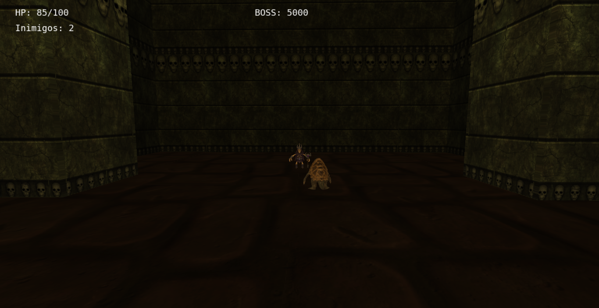

Relatório Trabalho  
Contribuições:  
Emanuel Rauter:  
-Efeitos Sonoros  
-Gouraud Shading  
-Phong Shading  
-Iluminação Lambert (Difusa)  
-Escolha e implementação de Texturas  
-Escolha e implementação Modelos  
-Spawn Inimigos (Uso de uma mesma matriz modelo para várias instâncias)  
-Colisão AABBxAABB  
-Câmera Look-At  
  
Gabriel Stoffel:  
-Câmera primeira pessoa  
-Projéteis e lógica de tiro  
-Construção do mapa  
-Iluminação Phong  
-Iluminação considerando tochas como fonte de luz  
-Curva de Bezier para movimentação de inimigos  
-Colisão AABBxPlano  
-Colisão Ponto-Esfera  
-Lógica do jogador e inimigos  
-Animações em tempo real  
-Modo Pausa  

Uso de IA:  
O ChatGPT foi utilizado no trabalho, principalmente na resolução de dúvidas sobre colisões e para correções do bug no código. A consulta com ia se mostra mais efetiva de forma inversamente proporcional com a quantidade de contexto do programa necessário para resolver a tarefa, ou seja, questões como pedir funções pontuais como testes de colisões ou verificar erros no shader de fragmentos (ambas utilizadas no trabalho), tiveram resultados extremamente efetivos que ajudaram o grupo no desenvolvimento do trabalho. Por outro lado, problemas ou funções que começam a envolver relações entre classes separadas começaram a gerar respostas não satisfatórias da IA que diversas vezes perdia o contexto e respondia de forma inválida a questionamentos nestes casos (ocorria um bug que o print do texto do crosshair não permitia atualização da câmera primeira pessoa, ChatGPT foi incapaz de ajudar na resolução do problema). IA também se mostrou útil em questões teóricas de como começar a pensar na implementação de alguma função, um exemplo foi a parte da diferença de ângulo entre dois vetores (que é usado para rotacionar o boss e os inimigos), o ChatGPT respondeu com a função utilizada para isso e o grupo então criou a função para isso.  

Desenvolvimento:  
Grupo começou desenvolvimento em cima do Laboratório 2 (câmera look-at e livre) e a partir daí foi lentamente contruindo junto com os respectivos laboratórios passados. Começando com uma simples implementação que criava um cubo e uma câmera look-at básico, depois foi adicionado a pilha de matrizes modelo e se criava já um cenário básico com um cubo player que já podia ser controlado o movimento pelas teclas e com câmera look-at em cima de um plano básico (sem paredes e teto), também já se criava várias instâncias de cubos inimigos que já se rotacionavam olhando na direção do player. O próximo passo foi implementação de carregamento de .obj e escolha do modelo de inimigos que conseguiam com sucesso spawnar (foi introduzido também um shader básico que só pintava com cores cada objeto). Logo após isso foi expandido o jogo e passou do cenário básico para um proto-arena montada, que consistia de um cubo gigante (plano, paredes e teto) que o player se movimentava, foi também introduzida a lógica de projéteis, colisões com planos e câmera de primeira pessoa nesta parte. Logo após isso ocorreu a apresentação parcial, após esclarecer dúvidas e receber ponteiros de ajuda, o grupo implementou texturas e uma parte de iluminação completa, introduzindo iluminação difusa e por phong e também shading por vértice e por pixel. Para paredes, piso e teto, estes eram iluminados de forma difusa ideal e por vértice; todos outros objetos eram iluminados de forma difusa+Phong e shading por pixel. Também foi implementado o modelo do player que é composto de 2 objetos (player+varinha) que usam os conceitos de operações sucessivas em matriz modelos empilhadas e desempilhadas para se manterem juntos. Após isso foi criado a arena completa e uma lógica de jogo de verdade (player tem que matar boss e ganhar ou morrer para os inimigos e perder), foi introduizdo finalmente o boss dragâo que estava apenas sendo testado antes e toda sua lógica de atirar. Implementada versão primitiva de colisão de player e inimigos. Após isso, a maioria parte do desenvolvimento foi refinar e atualizar o jogo, mudando a iluminação de uma luz universal para a luz partir a partir de tochas no mapa e introduzindo power-ups e modos de dificuldade. Por último, o grupo sofreu bastante com a parte de colisões e curva de bezier, optando para as colisões ter AABBxPlano para lidar colisões com as extremidades da arena, AABBxAABB para lidar colisões entre player, inimigos e colunas e por fim usando Ponto-Esfera para toda parte de projéteis e suas colisões. O grupo implementou uma versão inicial da curva de Bezier que gerava pontos aleatório entre o inimigo e o player para simular um "zig-zag", mas encontrou porblemas com a colisão entre inimigos e colunas, então foi trocada a lógica para usar Curvas de Bezier Hermite com 2 vetores tangentes (gera curva cúbica), além de implementar um teste de colisão antes de validar a curva de Bezier, resultando numa versão final bem superior a antiga. A última parte implementada foi a introdução de efeitos sonoros e melhorar a aparência dos menus do jogo.  

Imagens:  
Primeira pessoa (dentro do jogo):  

Look-at (dentro do jogo):  

Menu Principal

1, 2 ou 3 – Escolher dificuldade e iniciar partida

ESC – Sair do jogo

Durante a partida
Primeira pessoa

W, A, S, D – Mover personagem relativo ao olhar

Arrastar mouse – Alterar câmera

Clique esquerdo – Atirar

P – Modo Pause

F – Trocar para Look-At

Look-At

W, A, S, D – Mover personagem relativo aos eixos globais

P – Modo Pause

F – Trocar para primeira pessoa

Segurar clique esquerdo + arrastar – Alterar câmera

Modo Pause

A, D – Alternar visualização entre player e inimigos

P – Sair do Pause

Segurar clique esquerdo + arrastar – Alterar câmera

Tela de resultado (Vitória ou Game Over)

R – Reiniciar partida

M – Voltar ao menu principal 

Como executar:  
